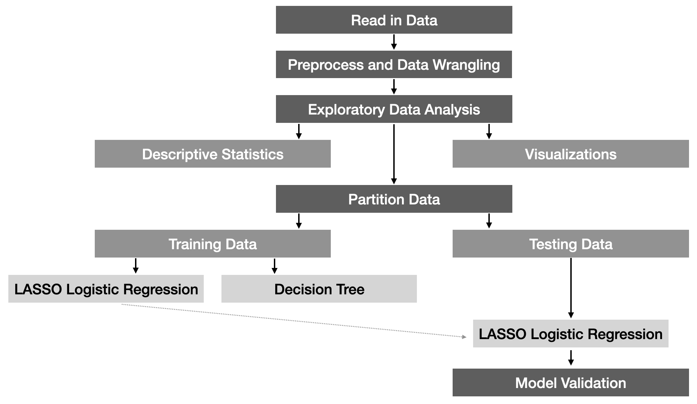

# IXIS Technical Challenge
 Code and Documentation for IXIS Technical Challenge
 

## How to use this repository?
* Install the following `R` packages:
  - `targets`
  - `tidymodels`
  - `vip`
  - `ggcorrplot`
  - `readr`
  - `skimr`
 
* Clone/download the repository

* Open `ixis.Rproj` in RStudio (though this isn't necessary)

* Open `_targets.R` to see my ML pipeline, Lines 25 - 65.
  - A diagram of this pipeline can be seen by `tar_visnetwork()`
    
* Run `tar_make()` to create all the output which will be saved in `_targets/objects`. These objects be read with `tar_read()` 

* The `function.R` has all the hard work and is well documented. 

* The presentation is available at http://cddesja.github.io/ixis_technical_challenge. A PDF of this presentation is available in `presentation.pdf`.

## Technical Description

### Purpose
The purpose of this challenge was to help a marketing executive at a large bank (1) understand which characteristics of potential customers are the best predictors of purchasing of one of the bank’s products and (2) to develop a predictive model to score each potential customer’s propensity to purchase. 

### Model Methodology and Justification
Based on these two objectives, a LASSO logistic regression and a decision tree were fit. Logistic regression models were examined as they (a) are highly interpretable, (b) their properties are well understood, (c) potential known to the end user and (d) fast to run. In situation of linear relations between features and the response variable, on the logit scale, they preform well. Given there were 19 candidate features, a couple of approaches to selecting the best logistic regression model were considered: stepwise logistic regression and penalized logistic regression. Either approach would result in a final model with fewer features. In general, penalized logistic regression tends to perform better, in terms of bias/variance tradefoff, than stepwise and thus this approach was selected. Finally, LASSO was performed over ridge or elastic net as it can shrink features' cofficients to 0. 

The other modeling framework considered was a decision tree. Decision trees are helpful when nonlinear relations are expected. They are more flexible than logistic regression, while still being highly interpretable. The decision to consider a decision tree over random forest, e.g., was that if this model fit better than logistic regression it would be possible to communicate modeling findings with tree diagrams rather than just variable importance. 

### Diagram of ML pipeline

The exact pipeline that was used is available in the `_targets.R`, see lines 25 - 65, and is shown in the diagram below.

A greatly simplified version of the major components in this pipeline is shown in the diagram below.

Provide written documentation describing:

The first step in the pipeline involves reading in the data. Because this data set was small and available as a CSV file, `readr::read_delim()` was used. If this was a larger dataset, then either `data.table::fread()` or `arrow::read_csv_arrow()` could be used to speed up performance and, as needed, converted to a tibble.

The second step involved preprocessing and data wrangling. During this step, several categorical variables with unknown levels were recoded as NA and the decision was made to recode 999 for `pdays`, number of days that passed by after the client was last contacted from a previous campaign, to NA. This resulted in a substantial amount of missing data for `pdays` and thus `pdays` was dropped as a feature. An alternative approach could involved creating a new feature from `pdays` that takes on the values of 1, if contacted, and 0 if not contacted (i.e., `pdays == 999`). This would have enabled `pdays` to be retained, to some extent, as a feature. An ID variable was also created during this stage, `idvar`, though unnecessary; the outcome was recoded as a numeric variable for visualization purposes only (`y_bin`); all character were converted to factors, though this step was technically unnnecessary for the models examined; and finally missing data was removed. Removing missing data resulted in a loss of a lot of data (nearly 25%). A better approach, not considered for this exercise, would involve imputation, possibly multiple imputation, or even retaining `unknown` as a category. The major issue with listwise deletion is the potential introduction of bias. However, given time constraints for this exercise, imputation was not utilized.   

The third step involved EDA. EDA served two purposes: (1) as a data check to ensure that data contained no visible errors and (2) to understand potential relationships between the features and the outcome. For the visualization step, correlograms, barcharts, histograms, and empirical logit plots were examined. Correlograms were utilized to examined multicollinearity, which can affect parameter estimates and p-values; histograms and barcharts were utilized to understand marginal and joint distributions; and finally empirical logit plots were examined to understand relationships between features and the outcome. Several of the social and economic context attributes were highly correlated, however, as a principal goal for this project was prediction, all these attributes were retained. An potential alternative approach could involve using principal components analysis and extracting one or two components for these attributes and using these components as new features. As normality was not an assumption for these models, marginal histograms that were skewed were not transformed and histograms were used to ensure valid data. Finally, for the empirical logit plots, age showed a clear, nonlinear relationship with the logit of whether a client would subscribe to a term deposit. Nonetheless, no transformation or quadratic term for age was considered in the LASSO logistic regression model. This could be further examined. The decision tree does not require linear relationships, therefore these empirical logit plots are most relevant to the logistic regression model. 

The fourth step involved partitioning the data into a training and testing data set. The only decision here was the size of the testing data, which was set to 25% of the total data set, and the decision to stratify on the outcome in order to make sure that the proportion of clients subscribed to a term deposit were similar in both data sets.

The fifth step involved tuning the LASSO logistic regression and the the decision tree. Several key decisions were made. First, 10-fold cross-validation was used to select hyperparameters and estimate the model. Second, the hyperparameter space for both models needed to be defined. Finally, the criterion for selecting the hyperparameters needed to be selected. The criterion utilized here was AUC, though accuracy could have been utilized. Based on the training set, both the LASSO logistic regression and the decision tree gave comparable performance. Therefore, either model could have been selected and justified. Nonetheless, the LASSO logistic regression model was selected as it marginally better performance.

The final step involved validating the LASSO logistic regression model on the testing data and identify the features most important for predicting whether a client would subscribe to a term deposit. The final LASSO logistic regression had a good AUC (0.933) and a good accuracy (0.903) (see `fit_measures`). For identifying the importance variables, variable importance was utilized and to keep it simple for the client, the top five variables were selected and visualized (see `importance_plot`). These variables were employment variation rate, last contact duration, consumer price index, Euribor 3 month rate, and whether the previous market campaign was a success. 

## How Could This Model Be Deployed

A frontend for this model utilizing the estimated coefficients from the LASSO logistic regression could be developed. There could be either dialog boxes (such as employment variation rate, duration, etc) or a spreadsheet-like interface where the end-user could enter information about a client and the model could be run in the background. The predicted probabilit for a client could then be printed, potentially with a 95% confidence interval, or the predicted class. This could easily be created using [Shiny](https://shiny.rstudio.com/). Dials, or other user-friendly UIs, could be created.   